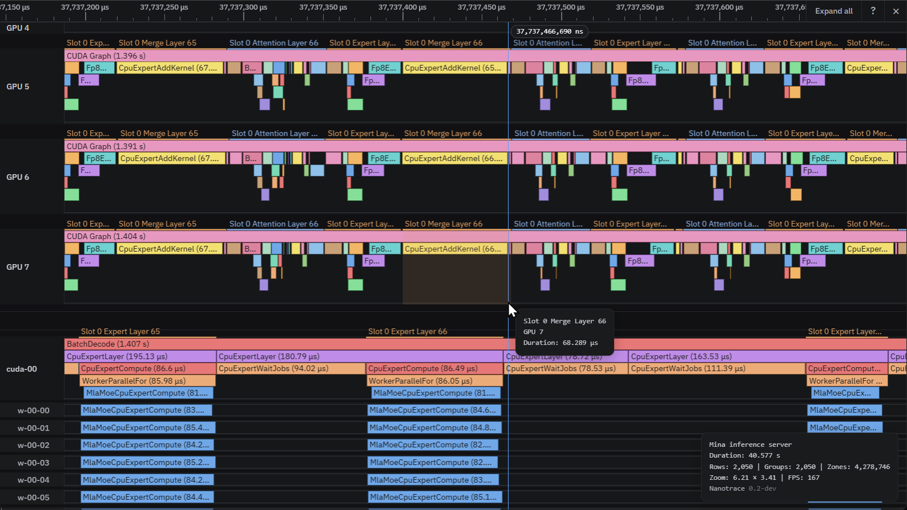
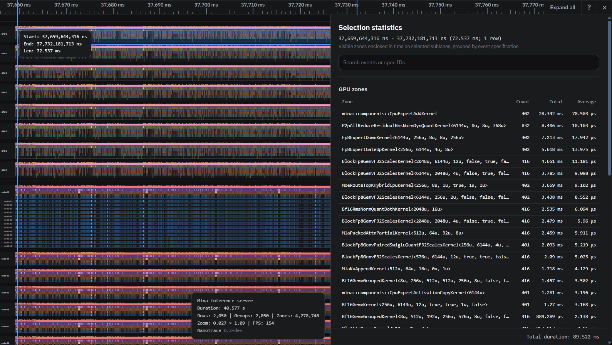

# nanotrace

Nanotrace is a low-overhead CPU and CUDA timeline tracer. It shows application
work, CUDA kernel execution, and events recorded inside kernels together in one
interactive view.

Use it to answer questions such as:

- What was each of the 256 CPU threads doing while the GPUs were running?
- When did each CUDA kernel actually execute?
- Which blocks, lanes, or application-defined stages were active inside a
  kernel?
- Where are the gaps and synchronization delays across the complete operation?



## One timeline from application to kernel

CPU scopes, hardware-recorded CUDA kernels, and explicit device events share
the same time axis. You can start with the complete application flow, expand a
GPU, then expand an individual kernel to inspect its blocks and instrumented
lanes without switching tools or manually aligning captures.



Nanotrace records three complementary event sources:

- **CPU tracing** for main threads, workers, scopes, and bookmarks;
- **CUDA kernel tracing** using CUPTI HES hardware timestamps;
- **intra-kernel tracing** using inexpensive, application-defined device
  events.

The WebGPU viewer handles large traces locally in the browser. Tracks can be
grouped into an application-defined hierarchy, and detailed GPU rows remain
collapsed until you need them.

## Dense CPU tracing without a profiler in the hot path

Each CPU thread records into its own fixed-capacity `CpuThreadContext`. Opening
and closing a zone reads the monotonic clock and appends a small record to that
thread's preallocated buffer. It does not allocate memory, acquire a global
trace lock, serialize data, or call into an attached profiling tool. Threads
flush their completed buffers later, outside the work being measured.

This gives CPU tracing very low and predictable overhead even across hundreds
of busy worker threads. The recorder is not literally free—the timestamp reads
and local writes still have a cost—but it is designed for much denser tracing
than a tool-facing annotation stream.

Unlike profiler-collected annotations such as NVTX, Nanotrace keeps the hot
recording path entirely in application-owned memory.

Choose the per-thread capacity up front and check `DroppedEventCount()` after
capture if losing events would matter. No dynamic allocation occurs when a
buffer fills; additional events are counted and dropped.

## Quick start

The standalone CUDA build currently requires CUDA 13.3, a C++20 compiler, and
an `sm_120a` Blackwell GPU.

Build the library and examples:

```bash
cmake -S nanotrace-cuda -B build -GNinja -DBUILD_EXAMPLES=ON
cmake --build build
```

Generate a trace that contains CPU scopes, CUDA kernel timing, and
intra-kernel events:

```bash
CUDA_VISIBLE_DEVICES=0 ./build/examples/unified_trace
```

Start the viewer:

```bash
cd visualizer
npm ci
npm run dev
```

Open the printed local URL and drop `unified_trace.nanotrace` onto the page.
The viewer also includes several samples that can be opened directly from its
start screen.

## Add Nanotrace to an application

Create `nanotrace::GpuTrace` before the application initializes CUDA, then use
CPU scopes and device trace handles around the work you want to inspect. The
library handles timestamp correlation, kernel matching, and trace
serialization.

The [CUDA and CPU API guide](nanotrace-cuda/README.md) covers:

- CPU thread contexts, nested scopes, parent tracks, and bookmarks;
- unified GPU capture and writing `.nanotrace` files;
- static and parameterized device events;
- compile-time instrumentation controls.

The complete working setup is also available in
[`unified_trace.cu`](nanotrace-cuda/examples/unified_trace.cu).

## Included examples

- `unified_trace`: CPU launch scopes, three hardware-timed CUDA kernels, and
  expandable intra-kernel events;
- `multistream_graph_trace`: a captured CUDA graph executing across two
  driver-selected streams;
- `cpu_hierarchy_trace`: application-defined parent and worker CPU tracks;
- `tma_bandwidth_bench_static`: statically distributed TMA transfers across
  170 blocks;
- `tma_bandwidth_bench_atomic`: dynamically distributed TMA transfers across
  170 blocks.

The generated sample traces are committed under `visualizer/public`. To check
any trace without opening the viewer, run:

```bash
cd visualizer
npm run validate -- /path/to/trace.nanotrace
```

## Project layout

- `nanotrace-cuda`: CPU and CUDA instrumentation, capture, and trace writing;
- `visualizer`: the browser-based WebGPU timeline viewer;
- `docs/nanotrace.md`: the v4 binary format and clock-correlation details.

## Current limitations

- CUPTI HES capture must be initialized before CUDA creates a context. Construct
  `nanotrace::GpuTrace` early and let the application initialize CUDA normally
  afterward.
- Blackwell HES does not support MPS, MIG, vGPU, WSL, or confidential-compute
  configurations.
- A single intra-kernel lane capture must finish within one 32-bit device-timer
  interval, approximately 4.29 seconds. Normal kernel instrumentation is far
  shorter than this.
- Define `NANOTRACE_DISABLED` in production builds that should contain no
  device instrumentation.

Low-level device-buffer layout, timestamp reconstruction, and file-format
details are documented in the [format specification](docs/nanotrace.md).

## License

MIT License; see [`LICENSE`](LICENSE).
