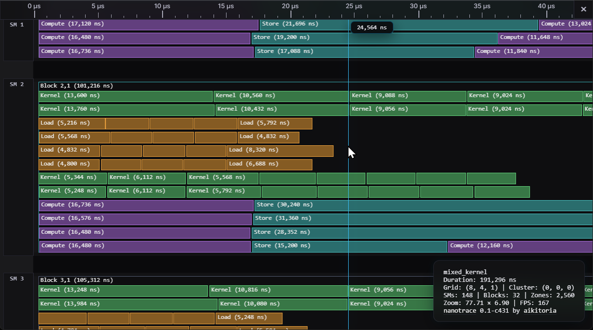
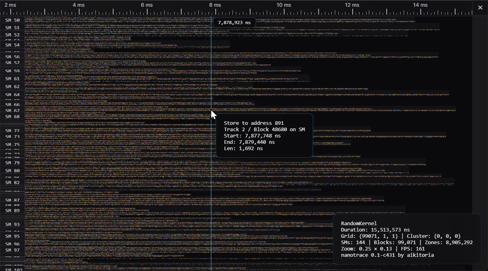

# nanotrace

Have you ever looked at nsys and wished you could zoom in much, much further?


Now you can! <sub>*\*Assuming you wrote that kernel*</sub>


Nanotrace reveals what your warp specialized and pipelined kernels are actually doing over time.



Enormous kernel traces with 10 million+ zones can be viewed without any issues.



## Overview

Nanotrace consists of a CUDA library for instrumenting kernels and a WebGPU visualizer for inspecting execution traces. Traces capture timing data with 32ns resolution using the GPU's global timer.

**Live demo**: [aikitoria.github.io/nanotrace](https://aikitoria.github.io/nanotrace)

## Components

**CUDA Library (`nanotrace-cuda/`):**
- Low overhead instrumentation
- Conditional tracing (enable/disable per-thread)
- Optional compression

**Visualizer (`visualizer/`):**
- WebGPU-based interactive timeline
- Independent X/Y zoom and time range selection
- Handles 10M+ events at 60 FPS

**File Format:**
- Compact binary with optional compression
- Nanosecond precision timing
- Full spec in `docs/nanotrace.md`

## Quick Start

### CUDA Library

```cpp
#include <nanotrace/nanotrace.cuh>
#include <nanotrace/nanotrace_host.h>

// Define trace types
NANOTRACE_DEFINE_TRACE_TYPE(Work, "Work", "Work execution", 0, nanotrace::lane_type::STATIC);
NANOTRACE_DEFINE_BLOCK_TYPE(Block, "Block {blockX}", "Block {blockX} on SM");
NANOTRACE_DEFINE_TRACK_TYPE(Warp, "Warp {lane}", "Warp {lane}", 0);

// Create trace tensor
using TraceConfig = nanotrace::static_trace_builder<8, Work, Work, Work, Work, Work, Work, Work, Work>;
TraceConfig trace(100, dim3(16, 1, 1));  // 100 events per lane

__global__ void kernel(nanotrace::static_tensor_handle<8, 2> handle) {
    uint32_t warp_id = threadIdx.x / 32;
    bool should_trace = (threadIdx.x % 32 == 0);  // Only lane 0 traces

    auto lane = nanotrace::begin_lane(handle, blockIdx.x, warp_id, should_trace);
    auto s = nanotrace::start();

    // ... work ...

    nanotrace::end(s, handle, lane, Work{});
    nanotrace::finish_lane(handle, lane);
}

int main() {
    kernel<<<dim3(16,1,1), dim3(256,1,1)>>>(trace.get_handle());

    // Configure track type on tensor
    trace.set_track_type<Warp>();

    nanotrace::trace_writer writer("kernel");
    writer.set_block_type<Block>();
    writer.register_trace_type<Work>();
    writer.add_tensor(trace);
    writer.write("trace.nanotrace");  // Logs statistics to stdout
}
```

Build with CMake (requires CUDA 13.0+, sm_100 target):
```bash
cd nanotrace-cuda
mkdir build && cd build
cmake ..
make
```

### Visualizer

Visit [aikitoria.github.io/nanotrace](https://aikitoria.github.io/nanotrace) or run locally:

```bash
cd visualizer
npm install
npm run dev
```

Sample traces included:
- **B200 samples**: Real kernel traces from NVIDIA B200 (Blackwell)
- **Test generators**: Synthetic traces for testing

## Navigation

- **Pan**: Right-click + drag
- **Zoom**: Scroll (X-axis), Shift+Scroll (Y-axis), Ctrl+Scroll (uniform)
- **Select time range**: Left-click + drag
- **Snap selection**: Double-click on zone or block
- **Reset view**: Press R

## Test Trace Generation

Synthetic traces for testing (TypeScript generators):

```bash
cd visualizer
npm run generate:minimal   # 1 block, 2 events
npm run generate:small     # ~50K events, 16 SMs
npm run generate:large     # ~10M events, 148 SMs
npm run validate <file>    # Validate binary format
```

## Project Structure

```
nanotrace/
├── nanotrace-cuda/          # CUDA tracing library
│   ├── include/nanotrace/   # Header-only device API
│   ├── src/                 # Host-side implementation
│   ├── examples/            # Example kernels
│   └── CMakeLists.txt
├── visualizer/              # WebGPU visualizer
│   ├── src/                 # TypeScript source
│   ├── scripts/             # Test trace generators
│   ├── public/samples/      # B200 sample traces
│   └── dist/                # Build output
└── docs/
    └── nanotrace.md         # Binary format specification
```

## Contributing & Feedback

This library is a work in progress and the API may change as it evolves. Suggestions and ideas are welcome! You can find me in the [GPU MODE Discord](https://discord.gg/gpumode).

## License

MIT License - see LICENSE file for details.
